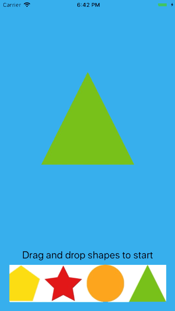

[](https://travis-ci.org/michaeldai1006/TDOuroboros)
[](https://cocoapods.org/pods/TDOuroboros)
[](https://cocoapods.org/pods/TDOuroboros)
[](https://cocoapods.org/pods/TDOuroboros)

TDOuroboros is an async task chaining library written in Swift.

- [Why TDOuroboros](#why-tdouroboros)
- [Usage](#usage)
  - [Use shared task queue instance](#use-shared-task-queue-instance)
  - [Create your own task queue](#create-your-own-task-queue)
- [Installation](#installation)
- [About](#about)
- [License](#license)

## Why TDOuroboros
TDOuroboros is an iOS library written in Swift which provides the ability to chain async tasks, such as animation tasks, HTTP request tasks, etc.  
Traditionally, connect async tasks can be done by nesting completion handlers, such as:
```swift
import UIKit

UIView.animate(withDuration: 1.0, animations: {
    // Perform animation 1
}) { (result1) in
    UIView.animate(withDuration: 1.0, animations: {
        // Perform animation 2
    }, completion: { (result2) in
        UIView.animate(withDuration: 1.0, animations: {
            // Perform animation 3
        }, completion: { (result3) in
            print("Animation 1-3 executed");
        })
    })
}
```
**There are 2 major defects about this approach:**
1. Pyramid of doom
2. Unable to handle tasks generated at run time

**TDOuroboros handles tasks very differently:**  
A task queue shall be created at first, to keep and manage async tasks. Every time a new task is generated or defined, it shall be enqueued into the task queue created at the very beginning. After the completion of each task, it shall notify the task queue about the task has just been completed. The task queue will dequeue a new task and execute it.  

**As an example:**  
A demo iOS project is included in this repo, under subfolder *Example*.  
Every time the list of shapes is reordered by drag and drop, animation tasks of each shape will be enqueued into the shared task queue instance, in the order of from left to right on the list. After that the animation for each shape will be executed in order.  

<p align="center">
  
</p>

## Usage
### Use shared task queue instance
If only one task queue is needed for the App or the Framework you are creating, or if you wish to have one shared task queue which can be used anywhere in the Application. You can use the shared instance of task queue manager.
```swift
import TDOuroboros
import UIKit

// Enqueue a new task into the shared task queue manager instance
TDTaskQueueManager.shared.enqueue { [weak self] in

    // Task code here
    UIView.animate(withDuration: 1.0, animations: {
        print("Hello World")
    }, completion: { (result) in
        if (result) {
            // After task finished, notify task queue manager about task completed
            TDTaskQueueManager.shared.taskCompleted()
        }
    })

}
```
### Create your own task queue
You can always create your own task queue manager instance, many queue instances can coexist in one App/Framework.
```swift
import TDOuroboros
import UIKit

// Create new task queue manager instance
let taskQueue = TDTaskQueueManager()

// Enqueue a new task into the queue
taskQueue.enqueue { [weak self] in

    // Task code here
    UIView.animate(withDuration: 1.0, animations: {
        print("Hello World")
    }, completion: { (result) in
        if (result) {
            // After task finished, notify task queue manager about task completed
            self?.taskQueue.taskCompleted()
        }
    })

}
```
## Installation
TDOuroboros is available through [CocoaPods](https://cocoapods.org). To install
it, simply add the following line to your Podfile:

```ruby
pod 'TDOuroboros'
```

## About

We love PRs, come become part of the project!

## License

TDOuroboros is available under the MIT license. See the [LICENSE](./LICENSE) file for more info.
